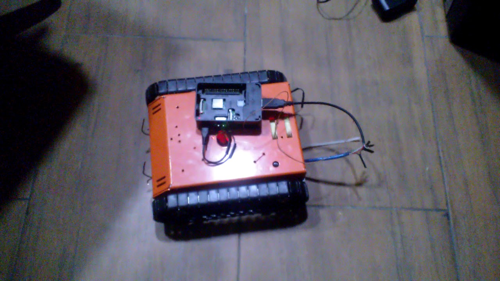
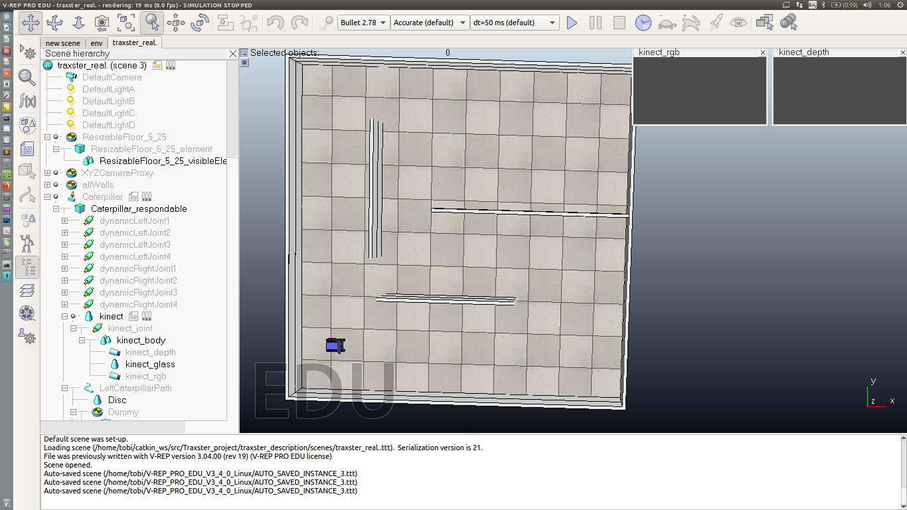
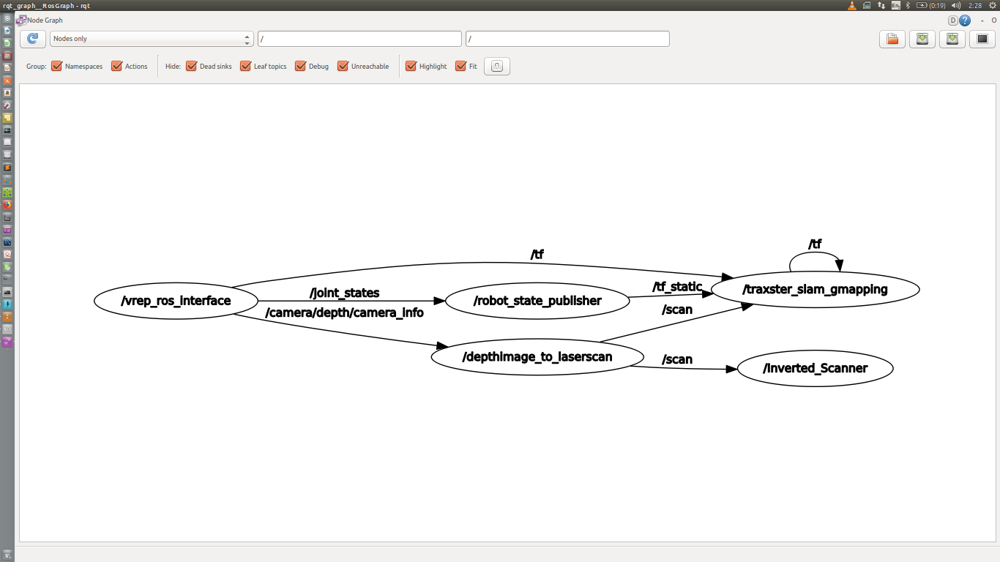
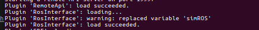
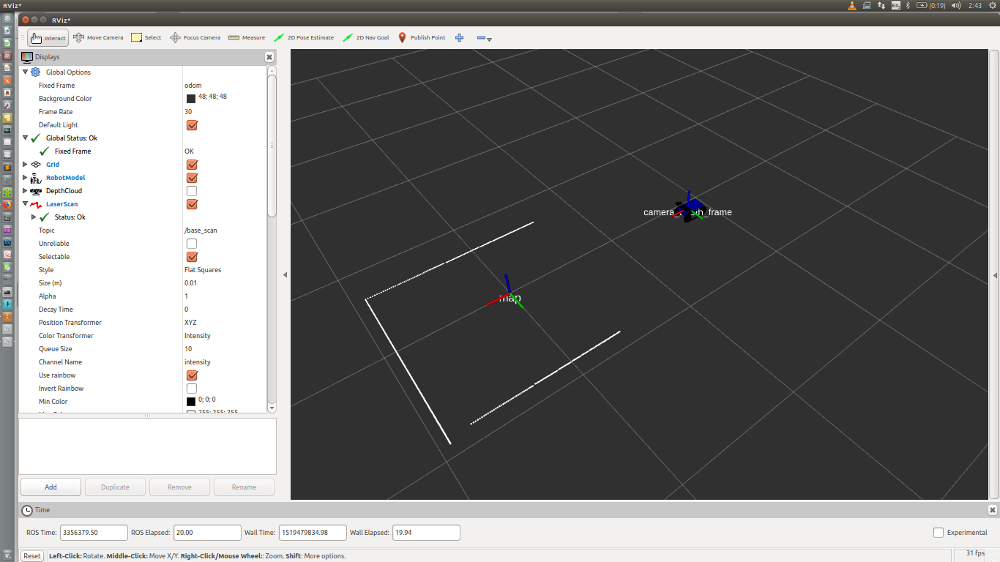

# TRAXSTER using ROS (Robot Operating System) and V-REP (robot simulator)

### Description
This is a project in partial fulfilment of the undergraduate study of systems engineering, univeersity of lagos. It is a simulator of the Traxster robot by RoboticsConnection to perform SLAM. I put it on here so it can be improved. This simulator is for testing of algorithm before running it on the hardware. https://www.youtube.com/watch?v=WXGIw6eK2No

 





* Control the mobile robot in the `vrep` simulation environment with keyboard
* roslaunch ros nodes



## TODOS

* Build 2D grid map with laserscan data via `rviz`
* Image Recognition and localization
* Visual Servoing (follow the yellow ball)


## SETUP
#### ROS install and catkin
1. Install catkin: http://wiki.ros.org/catkin
2. Install ROS: http://wiki.ros.org/ROS/Installation
3. Configure and create catkin workspace
```
$ echo "source /opt/ros/kinetic/setup.bash" >> ~/.bashrc
$ source ~/.bashrc
$ mkdir -p ~/catkin_ws/src
$ cd ~/catkin_ws/
$ catkin_make
$ echo "source ~/catkin_ws/devel/setup.bash" >> ~/.bashrc
$ source ~/.bashrc
```
4. Install the needed ros packages
```
#install hector slam
$ sudo apt install ros-kinetic-gmapping-slam

#install teleop key
$ sudo apt-get install ros-kinetic-teleop-twist-keyboard
```
#### Install V-REP
1. Dowload V-REP: http://www.coppeliarobotics.com/downloads.html
```
$ cp V-REP_PRO_EDU_V3_4_0_Linux.tar.gz ~
$ tar -zvxf ~/V-REP_PRO_EDU_V3_4_0_Linux.tar.gz
$ mkdir ~/V-REP
$ mv ~/V-REP_PRO_EDU_V3_4_0_Linux ~/V-REP
```
#### TO inteface ROS with V-REP
* Follow this link http://analuciacruz.me/articles/RosInterface_kinetic/ coustesy of Ana Lucia Cruz Ruiz


## RUN
1. open one terminal and run `$ roscore`
2. open another terminal and run `$ . ~/V-REP/vrep.sh`
>  Please pay attention to these message and if you see 
```
Plugin ’RosInterface’: loading...
Plugin ’RosInterface’: load succeeded.
```



3. open `traxster_description/scenes/traxster_real.ttt` in vrep's scene and press the start bottom
4. control the robot by keyboard
```
$ rosrun teleop_twist_keyboard teleop_twist_keyboard.py
```
5. launch the ros nodes to visualize in rviz
```
$ roslaunch traxster_2dnav traxster_slam.launch
```





### Credits
* Chien-Sheng Jason Wu for using his ros-vrep project readme to write the readme for this project

